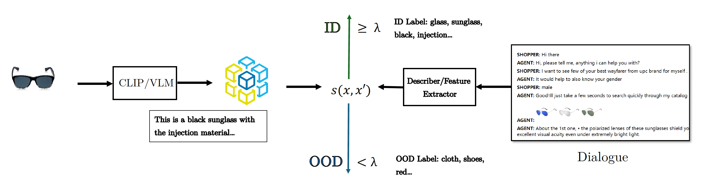

# Multi-modal OOD Detection
This repo contains the materials for multi-modal OOD detection.


## Project Structure

```
├─── dataset                 <- Main dataset folder
│   ├─── coco                <- COCO2014 Dataset
│   ├─── visdial             <- Visual Dialog Dataset
│   └─── mmd                 <- Multimodal Detection Dataset
│
├─── notebooks               <- Notebooks for the project
│   ├─── a.ipynb             <- Notebook a
│   └───  b.ipynb            <- Notebook b
│   
├─── models                  <- Trained and serialized models, model predictions, or model summaries
└─── reports                 <- Generated analysis / reports 
```

## Project Description
Given a dataset with $((i_k, t_k), y_k)$ with $k = 1, 2, \cdots, n$ and the label $y_k$, we could use the vision-language model to embed the image $i_k$ with the abstract feature $x_{i,k}$, and also we could embed the dialogues with another text embedding $x_{t,k}$. To classify the relevance of an image to a dialogue according to the label $y_k$, we use a scoring function, $s(x, x')$, which evaluates the similarity or relevance between two hidden inputs, and produces a numeric score. A threshold value, denoted as $\lambda$, helps us to determine the classification. Based on this setup, we define two categories:

### Definitions of In-Domain (ID) and Out-Of-Domain (OOD)
- **In-domain**: given both measures $t_i$ from the images and $t_d$ from the dialogue, we say the image is in-domain with the dialogue if $s(t_i, t_d) \geq \lambda$. 
- **Out-of-domain**: given both measures $t_i$ from the images and $t_d$ from the dialogue, we say the image is out-of-domain with the dialogue if $s(t_i, t_d) < \lambda$. 

With the above definition, given an image-text data pair $(I^d, T^d)$, we are going to examine whether it is ID or OOD per image-dialogue in the given label set $\mathcal{Y}$. To this end, we draw the overall workflow in the figure below.



In the given scenario, we employ a strategy that leverages advanced vision models like CLIP to derive meaningful descriptors or feature embedding from images. Similarly, for dialogues, we extract pivotal descriptors using techniques such as semantic analysis and we also do a feature embedding for the dialogues. These processes yield embeddings $x_{i,k}$ for images and $x_{t,k}$ for dialogues. Utilizing these embeddings, we apply a scoring function $s(x_{i,k}, x_{t,k})$ to assess the relevance between an image and a dialogue. The outcome of this function helps us determine whether the image-dialogue pair falls within the in-distribution categories, indicating a high relevance, or the out-of-distribution category, suggesting low or no relevance.


## Dataset

