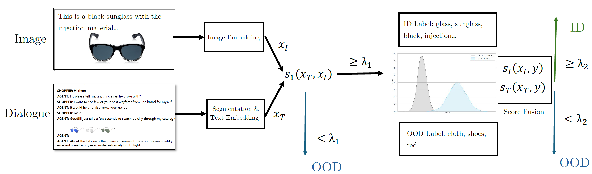
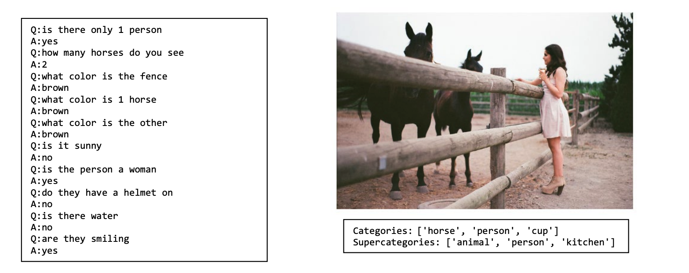
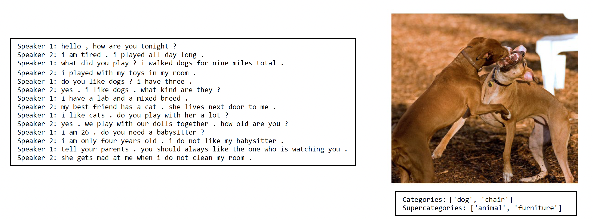

# Multi-modal OOD Detection
This repo contains the materials for multi-modal OOD detection.


## Project Structure

```
├─── dataset                 <- Main dataset folder
│   ├─── coco                <- COCO2014 Dataset
│   ├─── visdial             <- Visual Dialog Dataset
│   └─── mmd                 <- Multimodal Detection Dataset
│
├─── notebooks               <- Notebooks for the project
│   ├─── a.ipynb             <- Notebook a
│   └───  b.ipynb            <- Notebook b
│   
├─── models                  <- Trained and serialized models, model predictions, or model summaries
├─── literatures             <- Contains all literatures for OOD detection
├─── figures                 <- Contains all figures used for this project
├─── utils                   <- Contains all util functions for this project
└─── reports                 <- Generated analysis / reports 
```

## Notebook Running

### MMD Dataset Creation
To create the datasets for real MMD OOD data, please follow the procedures listed below:
1. \[Data Source:\] Download dataset from [MMD dataset](https://github.com/shh1574/multi-modal-dialogue-dataset/) with the [link](https://drive.google.com/drive/folders/12-Zz4MJTASJVlbncpSWvBVqLDe5_m5QU), also download COCO2014 dataset(https://cocodataset.org/#home) and put them under `dataset/mmd` and `dataset/coco`, respectively. The COCO data structure will be looking like below:
```
├─── dataset                    <- Main dataset folder
│   ├─── coco                   <- COCO2014 Dataset
│   │    ├─── coco_annotations  <- image annotations
│   │    ├─── train2014         <- train images
│   │    ├─── val2014           <- val images
```
The mmd data structure will be as follows:
```
├─── dataset                    <- Main dataset folder
│   ├─── mmd                    <- MMD Dataset
│   │    ├─── dev               <- validation split
│   │    ├─── test              <- test split
│   │    ├─── train             <- train split
│   │    ├─── sample            <- processed target dir
```

1. \[Dataset Generation:\] Then run the notebook `mmd_dataset_creation.ipynb` to create the Real OOD dataset. Then the dialogue and label data can be found under `dataset/mmd/sample/sample.json` and the corresponding images can be found under the directory `dataset/mmd/sample/images`.


### QA Dataset Creation
1. \[Data Source:\] Download [0.9 version visdial dataset](https://visualdialog.org/data) and COCO2014 dataset(https://cocodataset.org/#home) and put them under `dataset/coco` and `dataset/visdial`, respectively. The COCO data structure will be looking like below:
```
├─── dataset                    <- Main dataset folder
│   ├─── coco                   <- COCO2014 Dataset
│   │    ├─── coco_annotations  <- image annotations
│   │    ├─── train2014         <- train images
│   │    ├─── val2014           <- val images
```
The visdial data structure will be as follows:
```
├─── dataset                            <- Main dataset folder
│   ├─── visdial                        <- Visdial Dataset
│   │    ├─── visdial_0.9_train.json    <- Training dialogue json
│   │    ├─── visdial_0.9_val.json      <- Validation dialogue json
```
2. \[Dataset Generation:\] Run the notebook `qa_dataset_creation.ipynb` with basic dev requirements. Then the dialogue and label data can be found under `dataset/qa/sample.json` and the corresponding images can be found under the directory `dataset/qa/images`.

### Dataset Viewing
To run the notebooks for examining the datasets, please follow the procedures listed below:
1. Download the dataset for both qa and real OOD datasets from [this link](https://drive.google.com/drive/folders/1w4OO7s4HYhpimZiPhIv2JdWN6Pc0d8_S?usp=sharing).
2. Put the data into `dataset/qaood` and `dataset/realood` and extract `sample.zip` for both datasets.
3. To view the data, one may use `example_showing.ipynb` for viewing the examples.

## Project Description
Given a dataset with $((i_k, t_k), y_k)$ with $k = 1, 2, \cdots, n$ and the label $y_k$, we could use the vision-language model to embed the image $i_k$ with the abstract feature $x_{i,k}$, and also we could embed the dialogues with another text embedding $x_{t,k}$. To classify the relevance of an image to a dialogue according to the label $y_k$, we firstly use a scoring function, $s_1(x_i, x_t)$, which evaluates the similarity or relevance between the image and text embeddings, and produces a numeric score. A threshold value, denoted as $\lambda_1$, helps us to determine the classification of ID and OOD. If the similarity score is below certain $\lambda_1$, we just simply treat the pair as OOD, otherwise, we will further compare these two embeddings with the ID label set with the score function $s_t(x_t, y)$ and $s_i(x_i,y)$, we could do a fusion on these two scores $g(s_t, s_i)$ and check if it exceeds $\lambda_2$ to determine whether it is ID or OOD. Based on this setup, we define two categories:

### Definitions of In-Domain (ID) and Out-Of-Domain (OOD)
- **In-domain**: given both embeddings $x_i$ from the images and $x_t$ from the dialogue, and a certain label $y$. We say the image is in-domain with the dialogue if $s_1(x_i, x_t) \geq \lambda_1$ and $g(s_t(x_t, y), s_i(x_i,y)) \geq \lambda_2$. 
- **Out-of-domain**: given both embeddings $x_i$ from the images and $x_t$ from the dialogue, we say the image is out-of-domain with the dialogue if $s_1(x_i, x_t)$ < $\lambda_1$ or $s_1(x_i, x_t) \geq \lambda_1$ but $g(s_t(x_t, y), s_i(x_i,y))$ < $\lambda_2$. 

With the above definition, given an image-text data pair $(I^d, T^d)$, we are going to examine whether it is ID or OOD per image-dialogue in the given label set $\mathcal{Y}$. To this end, we draw the overall workflow in the figure below.



In the given scenario, we employ a strategy that leverages advanced vision models like CLIP to derive meaningful descriptors or feature embedding from images. Similarly, for dialogues, we extract pivotal descriptors using techniques such as semantic analysis and we also do a feature embedding for the dialogues. These processes yield embeddings $x_{i,k}$ for images and $x_{t,k}$ for dialogues. Utilizing these embeddings, we apply a scoring function $s_1(x_{i,k}, x_{t,k})$ to assess the relevance between an image and a dialogue. The outcome of this function helps us determine whether the image-dialogue pair falls within the categories, indicating a high relevance, or the out-of-distribution category, suggesting low or no relevance. Then if they are within the same categories, we will further compare the whole pair with the label set to determine if the pair is ID or OOD.


## Dataset

### QA OOD Dataset

We used the [Visdial dataset](https://visualdialog.org/) to create the OOD dataset with QA systems. The dataset has over 120K images from the COCO2014 image dataset and collected QA dialogues with one-to-one mapping. We created a sample dataset that contains 9915 pairs, with each pair having an image, a conversation, and a set of labels. The data contains the following fields:

| Fields         | Meaning                              | Example                                          |
|----------------|--------------------------------------|--------------------------------------------------|
| image_id       | Image index                          | 265744                                           |
| dialog         | The whole dialogue in dictionary     | [{'answer': 71412, 'gt_index': 0, 'question': ...] |
| caption        | The image caption                    | a person standing next to a fence with horses    |
| dialog_full    | The full dialog text                 | Q:is there only 1 person, A:yes, Q:how many ho... |
| categories     | Categories in the image              | [dog, chair]                                     |
| supercategories | High-level categories in the image  | [animal, furniture]                              |

*Table: Descriptions for QA MMD Dataset*

The dataset stat is summarized as follows.

| Stats               | Figures |
|---------------------|---------|
| # Pair              | 9915    |
| # Image             | 9915    |
| # Dialogue          | 9915    |
| # Turn per dialog   | 10      |
| # Categories        | 80      |
| # Supercategories   | 12      |

*Table: Dataset Stats of QA mmd dataset*

The dataset encompasses a total of 12 higher-level categories, namely `animal`, `person`, `kitchen`, `food`, `sports`, `electronic`, `accessory`, `furniture`, `indoor`, `appliance`, `vehicle`, and `outdoor`. These supercategories are further subdivided into 80 more specific categories, providing a detailed classification framework. One example pair is shown as follows.




### Real MMD OOD Dataset
Lee et al. (2021) presents a 45k multi-modal dialogue dataset and the dataset creation method. This dataset is meant for training and evaluating multi-modal dialogue systems. Each multi-modal dialogue instance consists of a textual response and a dialogue context with multiple text utterances and images. The dataset details can be found in the [this repo](https://github.com/shh1574/multi-modal-dialogue-dataset) and the paper is available in the [this paper](https://aclanthology.org/2021.acl-short.113.pdf). The data contains the following fields:

| Fields          | Meaning                           | Example                                 |
|-----------------|-----------------------------------|-----------------------------------------|
| dialog          | The whole dialogue                | ['hello, how are you tonight ?', 'i am tired.', ...] |
| dialog_dataset  | The dialogue source dataset       | persona, dailydialog, or empathy       |
| img_dataset     | The image source dataset          | COCO                                    |
| img_file        | Original image file name          | COCO_val2014_000000283210.jpg           |
| set_source      | Dataset version                   | val2014                                 |
| image_id        | Transformed Internal image index  | 2000000283210                           |
| image_idx       | Original image index              | 283210                                  |
| categories      | Categories in the image           | [dog, chair]                            |
| supercategories | High-level categories in the image | [animal, furniture]                     |
| score           | The similarity score between image and dialogue | 0.580191          |

*Table: Descriptions for Real MMD Dataset*

Note that in this real mmd dataset, the dialogue and images are collected from different sources and they could be paired across different images and dialogues. That is, we could have one image pairing with different dialogues or one dialogue pairing with different images. The dataset stat is summarized as follows.

| Stats             | Figures |
|-------------------|---------|
| # Pair            | 16980   |
| # Image           | 6912    |
| # Dialogue        | 7452    |
| # Turn per dialog | 1 - 18  |
| # Categories      | 80      |
| # Supercategories | 12      |

*Table: Dataset Stats of Real MMD Dataset*

One example pair is given below.



